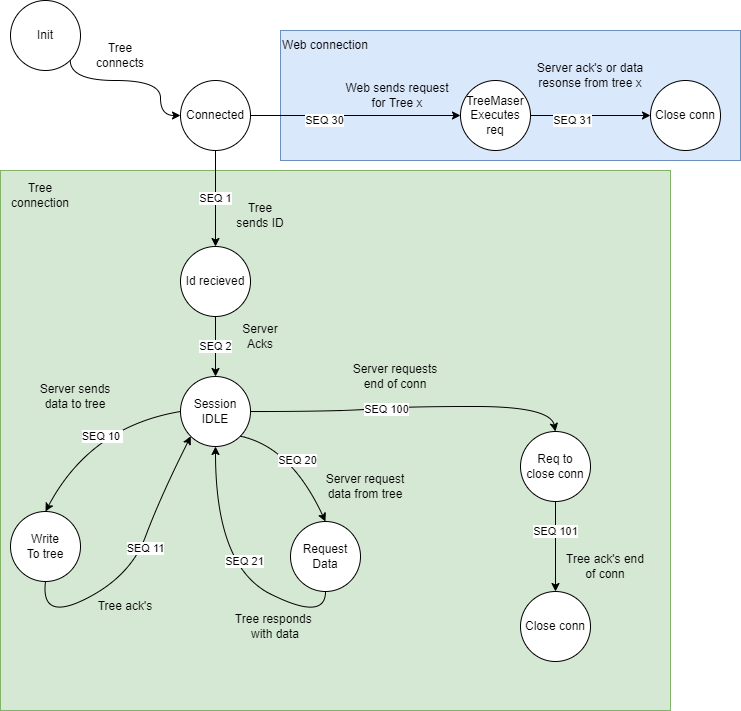

# TUCT 2k22

*The Ultimate Cristmas Tree*

## Components

* `firmware` - Pico-W Running Micro-Python on the Tree-PCB
* `web` - Blazor-Container in cloud handling the interactions with the user

## Donwload to PICO

Only download the contents of the *firmware* folder!

## Tree master

